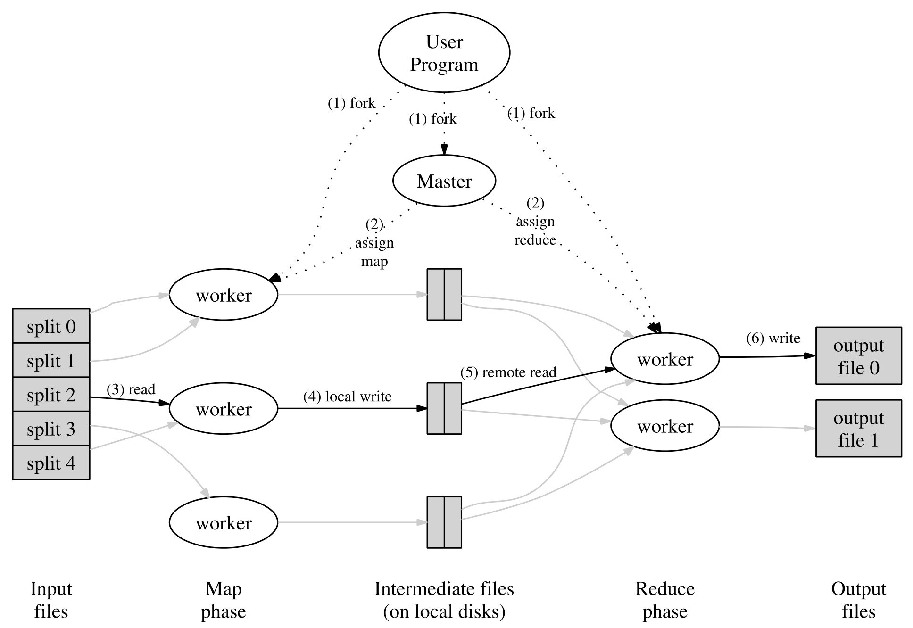

# MIT6.824
MIT6.824-2020课程学习笔记与总结，遵循协议实验代码不开放，仅提供思路。

## 相关资料

- 视频地址：[bilibili](https://www.bilibili.com/video/BV1R7411t71W?from=search&seid=17665770671693338916), [YouTube](https://www.youtube.com/channel/UC_7WrbZTCODu1o_kfUMq88g/videos)
- 课程安排：通过[Schedule](https://pdos.csail.mit.edu/6.824/schedule.html)可以获得包括课件，实验，源码，Q&A 等一系列资源。

> 感谢雷神项目组提供的翻译资源：[Github](https://github.com/ivanallen/thor)

## 课程

### lab1: MapReduce

论文链接：[MapReduce: Simplified Data Processing on Large Clusters](./pdf/mapreduce.pdf)

**核心思想：**

**算法流程：**

英文版

- The MapReduce library in the user program first splits the input files into M pieces of typically 16 megabytes to 64 megabytes (MB) per piece (controllable by the user via an optional parameter). It then starts up many copies of the program on a cluster of machines.
- One of the copies of the program is special – the master. The rest are workers that are assigned work by the master. There are M map tasks and R reduce tasks to assign. The master picks idle workers and assigns each one a map task or a reduce task.
- A worker who is assigned a map task reads the contents of the corresponding input split. It parses key/value pairs out of the input data and passes each pair to the user-defined Map function. The intermediate key/value pairs produced by the Map function are buffered in memory.
- Periodically, the buffered pairs are written to local disk, partitioned into R regions by the partitioning function. The locations of these buffered pairs on the local disk are passed back to the master, who is responsible for forwarding these locations to the reduce workers.
- When a reduce worker is notified by the master about these locations, it uses remote procedure calls to read the buffered data from the local disks of the map workers. When a reduce worker has read all intermediate data, it sorts it by the intermediate keys so that all occurrences of the same key are grouped together. The sorting is needed because typically many different keys map to the same reduce task. If the amount of intermediate data is too large to fit in memory, an external sort is used.
- The reduce worker iterates over the sorted intermediate data and for each unique intermediate key encountered, it passes the key and the corresponding set of intermediate values to the user’s Reduce function. The output of the Reduce function is appended to a final output file for this reduce partition.
- When all map tasks and reduce tasks have been completed, the master wakes up the user program. At this point, the MapReduce call in the user program returns back to the user code.

- 首先将输入文件分成M份，通常每份分成16M - 64M，并将程序部署集群中。
- 集群中的一个节点为master，其余的节点为worker，worker节点的任务由master节点指派。共有M个map任务，R个reduce任务，由master节点在worker节点中任意选择执行相应的任务。
- 被指派做map任务的worker节点读取相应的被切分的输入数据，它从输入数据中解析键/值对，并将每对键/值传递给用户定义的Map函数。Map函数产生的中间键/值对被缓冲在内存中。
- 程序会将缓冲对定期的写入本地磁盘，并通过分区函数划分成R个区域。这些缓冲对在本地磁盘中的位置将会被传递到master，master负责将这些位置转发给被指派reduce任务的worker。
- 当执行reduce任务的worker开始工作后会通过rpc从执行map任务的worker节点的本地磁盘读取数据，当reduce worker读取了所有的中间数据后，它将根据`中间键`对数据进行排序，以便将所有出现的相同键的组合放在一起（之所以需要排序，是因为通常有许多不同的键映射到同一个reduce任务），如果中间数据量太大，无法装入内存，则需要使用外部排序。
- reduce worker会迭代已排序的中间数据，对于遇到的每个惟一的中间键，它将键和相应的中间值传递给用户的reduce函数。Reduce函数的输出被追加到这个Reduce分区的最终输出文件中。
- 当所有的map任务和reduce任务都完成后，master唤醒用户程序。

### lab2: Raft

### lab3: KV_Raft

### lab4: Sharded_KV

## 推荐资源

 - 

书中引用：[https://github.com/ept/ddia-references](https://github.com/ept/ddia-references)

- [Distributed-Systems](https://github.com/feixiao/Distributed-Systems)